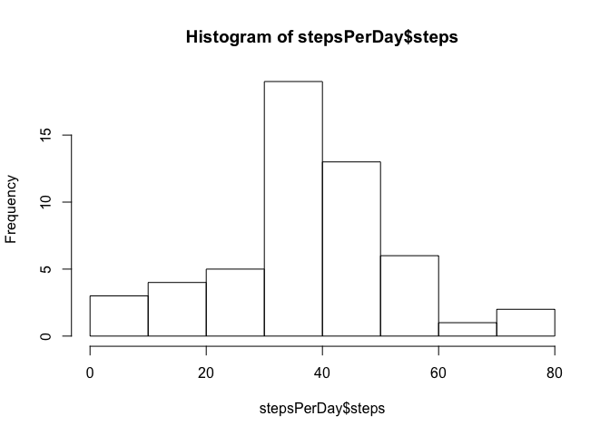
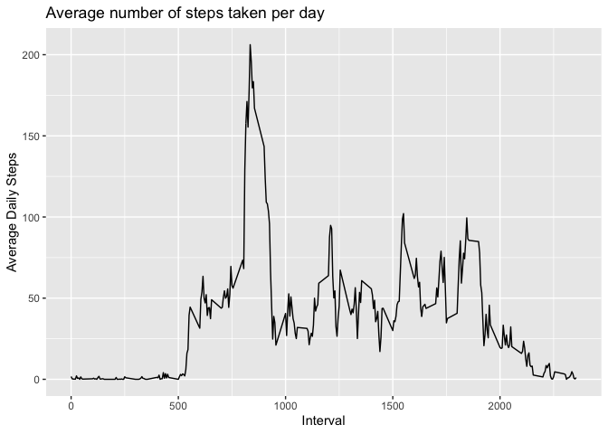
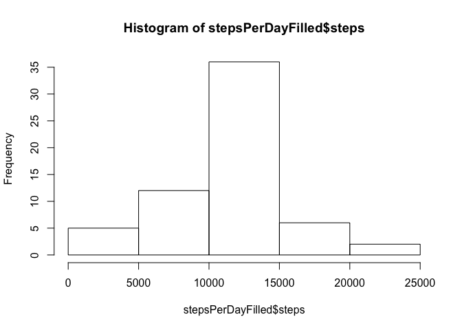
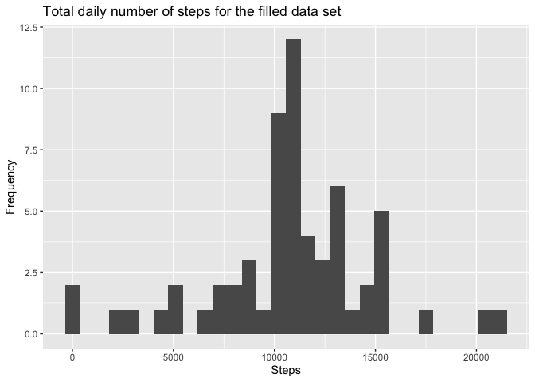
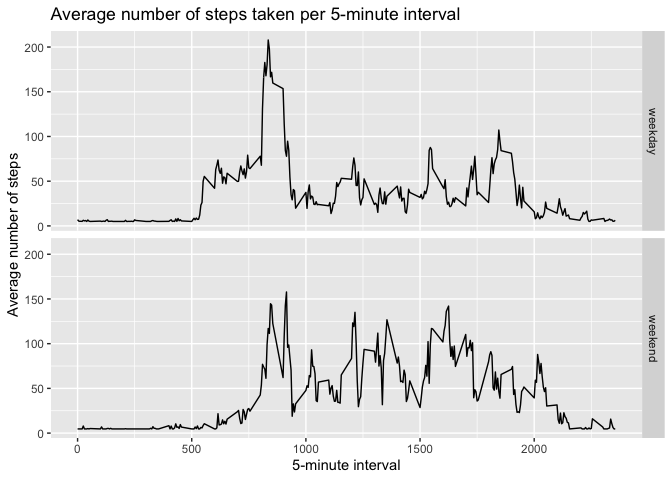

Introduction
------------

It is now possible to collect a large amount of data about personal
movement using activity monitoring devices such as a
[Fitbit](https://www.fitbit.com/it/home), Nike
[Fuelband](https://www.nike.com/help/a/why-cant-i-sync), or [Jawbone
Up](https://www.jawbone.com/up). These type of devices are part of the
“quantified self” movement – a group of enthusiasts who take
measurements about themselves regularly to improve their health, to find
patterns in their behavior, or because they are tech geeks. But these
data remain under-utilized both because the raw data are hard to obtain
and there is a lack of statistical methods and software for processing
and interpreting the data.

This assignment makes use of data from a personal activity monitoring
device. This device collects data at 5 minute intervals through out the
day. The data consists of two months of data from an anonymous
individual collected during the months of October and November, 2012 and
include the number of steps taken in 5 minute intervals each day.

The data for this assignment can be downloaded from the course web site:

Dataset: [Activity monitoring
data](https://d396qusza40orc.cloudfront.net/repdata%2Fdata%2Factivity.zip)
\[52K\].  
The variables included in this dataset are:

**steps**: Number of steps taking in a 5-minute interval (missing values
are coded as NA).  
**date**: The date on which the measurement was taken in YYYY-MM-DD
format.  
**interval**: Identifier for the 5-minute interval in which measurement
was taken.  
The dataset is stored in a comma-separated-value (CSV) file and there
are a total of 17,568 observations in this dataset.

Analysing the data set
======================

Loading and preprocessing the data
----------------------------------

    # Libraries loading
    library('dplyr')
    library('data.table')
    library('ggplot2')

    # File downloading
    if(!file.exists('./activity.csv')){
            fileURL <- 'https://d396qusza40orc.cloudfront.net/repdata%2Fdata%2Factivity.zip'
            download.file(url = fileURL, destfile = './activity.zip')
            unzip(zipfile = './activity.zip')
            rm(fileURL)
    }

    # Loading the data set
    ac <- fread(file = './activity.csv',
                   colClasses = c('integer', 'factor', 'integer'),
                   na.strings = 'NA')

What is the mean total number of steps taken per day?
-----------------------------------------------------

The total number of steps taken per day is:

    stepsPerDay <- ac %>% dplyr::group_by(date) %>% 
            dplyr::summarise(steps = mean(steps, na.rm = TRUE))
    head(stepsPerDay)

    ## # A tibble: 6 x 2
    ##   date         steps
    ##   <fct>        <dbl>
    ## 1 2012-10-01 NaN    
    ## 2 2012-10-02   0.438
    ## 3 2012-10-03  39.4  
    ## 4 2012-10-04  42.1  
    ## 5 2012-10-05  46.2  
    ## 6 2012-10-06  53.5

    hist(stepsPerDay$steps)

The mean and median of the total number of steps taken per day are:

    meanStepsPerDay <- mean(stepsPerDay$steps, na.rm = TRUE)
    medianStepsPerDay <- median(stepsPerDay$steps, na.rm = TRUE)

    meanStepsPerDay

    ## [1] 37.3826

    medianStepsPerDay

    ## [1] 37.37847

What is the average daily activity pattern?
-------------------------------------------

The time series plot (type = “l”) of the 5-minute interval (x-axis) and
the average number of steps taken, averaged across all days (y-axis) is:

    meanStepsInterval <- ac %>% dplyr::group_by(interval) %>% 
      dplyr::summarise(steps = mean(steps, na.rm = TRUE))
    head(meanStepsInterval)

    ## # A tibble: 6 x 2
    ##   interval  steps
    ##      <int>  <dbl>
    ## 1        0 1.72  
    ## 2        5 0.340 
    ## 3       10 0.132 
    ## 4       15 0.151 
    ## 5       20 0.0755
    ## 6       25 2.09

    ggplot(meanStepsInterval, aes(x = interval , y = steps)) + geom_line() + 
      labs(title = "Average number of steps taken per day", x = "Interval", 
           y = "Average Daily Steps")

The 5-minute interval that, on average, contains the maximum number of
steps is:

    maxStepsInterval <- meanStepsInterval[meanStepsInterval$steps == 
                                            max(meanStepsInterval$steps), 
                                          'interval']
    maxStepsInterval

    ## # A tibble: 1 x 1
    ##   interval
    ##      <int>
    ## 1      835

Imputing missing values
-----------------------

The number of rows and the percentage of NAs are:

    sum(is.na(ac$steps))

    ## [1] 2304

    mean(is.na(ac$steps))

    ## [1] 0.1311475

A strategy for filling in all of the missing values in the dataset may
be using the average number of steps. A new data set will be created:

    acFilled <- ac
    acFilled$steps[which(is.na(acFilled$steps) == TRUE)] <- 
            mean(acFilled$steps, na.rm = TRUE)
    data.table::fwrite(x = acFilled, file = "./activity_filled.csv", quote = FALSE)

The histogram of the total number of steps taken each day for the filled
data set is:

    stepsPerDayFilled <- acFilled %>% dplyr::group_by(date) %>% 
            dplyr::summarise(steps = sum(steps, na.rm = TRUE))
    hist(stepsPerDayFilled$steps)

The mean and median total number of steps taken per day are:

    meanStepsPerDayFilled <- mean(stepsPerDayFilled$steps, na.rm = TRUE)
    medianStepsPerDayFilled <- median(stepsPerDayFilled$steps, na.rm = TRUE)

    meanStepsPerDayFilled

    ## [1] 10766.19

    medianStepsPerDayFilled

    ## [1] 10766.19

These values differ from the estimates from the first part of the
assignment. In fact, the difference between the mean values of the two
data sets and the one between the medians are:

    meanStepsPerDayFilled - meanStepsPerDay

    ## [1] 10728.81

    medianStepsPerDayFilled - medianStepsPerDay

    ## [1] 10728.81

What is the impact of imputing missing data on the estimates of the
total daily number of steps?

    ggplot(stepsPerDayFilled, aes(x = steps)) + 
      geom_histogram() +
      labs(title = "Total daily number of steps for the filled data set",
           x = "Steps", y = "Frequency")

    ## `stat_bin()` using `bins = 30`. Pick better value with `binwidth`.

<table>
<thead>
<tr class="header">
<th>Data set</th>
<th>Mean steps</th>
<th>Median steps</th>
</tr>
</thead>
<tbody>
<tr class="odd">
<td>Original DS</td>
<td>37.3825996</td>
<td>37.3784722</td>
</tr>
<tr class="even">
<td>Filled DS</td>
<td>1.076618910^{4}</td>
<td>1.076618910^{4}</td>
</tr>
</tbody>
</table>

Are there differences in activity patterns between weekdays and weekends?
-------------------------------------------------------------------------

    acFilled <- acFilled %>% mutate(weekDay = weekdays(as.Date(date), abbr = TRUE))

    acFilled[grepl('Mon|Tue|Wed|Thu|Fri', acFilled$weekDay), 'weekPart'] <-
      'weekday'
    acFilled[grepl('Sat|Sun', acFilled$weekDay), 'weekPart'] <-
      'weekend'
    acFilled$weekPart <- as.factor(acFilled$weekPart)
    head(acFilled, 10)

    ##      steps       date interval weekDay weekPart
    ## 1  37.3826 2012-10-01        0     Mon  weekday
    ## 2  37.3826 2012-10-01        5     Mon  weekday
    ## 3  37.3826 2012-10-01       10     Mon  weekday
    ## 4  37.3826 2012-10-01       15     Mon  weekday
    ## 5  37.3826 2012-10-01       20     Mon  weekday
    ## 6  37.3826 2012-10-01       25     Mon  weekday
    ## 7  37.3826 2012-10-01       30     Mon  weekday
    ## 8  37.3826 2012-10-01       35     Mon  weekday
    ## 9  37.3826 2012-10-01       40     Mon  weekday
    ## 10 37.3826 2012-10-01       45     Mon  weekday

    meanStepsPerDayFilledWeekPart <- acFilled %>% 
      dplyr::group_by(interval, weekPart) %>%
      dplyr::summarise(steps = mean(steps))

    ggplot(data = meanStepsPerDayFilledWeekPart, aes(x = interval, y = steps)) +
      geom_line() + facet_grid(weekPart ~ .) +
      labs(title = 'Average number of steps taken per 5-minute interval') +
      ylab('Average number of steps') + xlab('5-minute interval')

